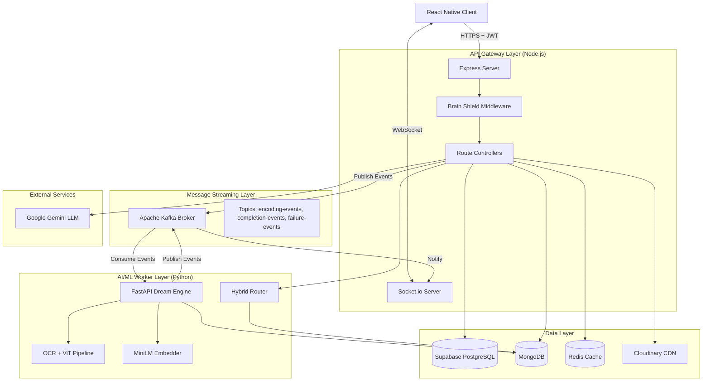
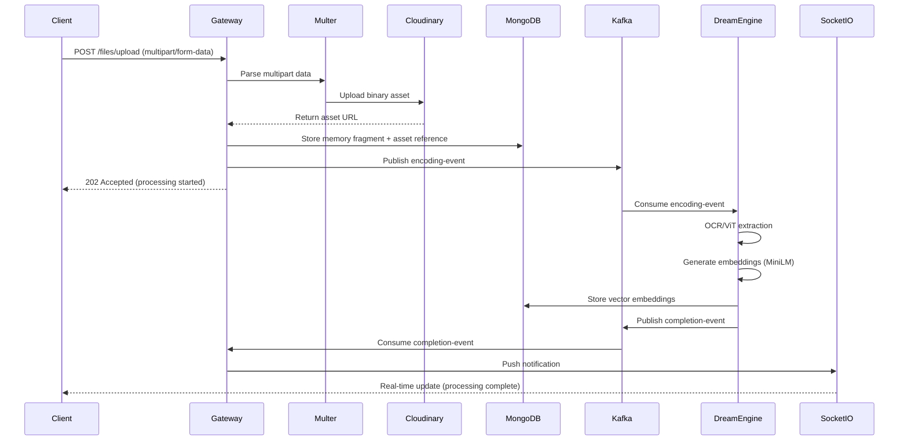
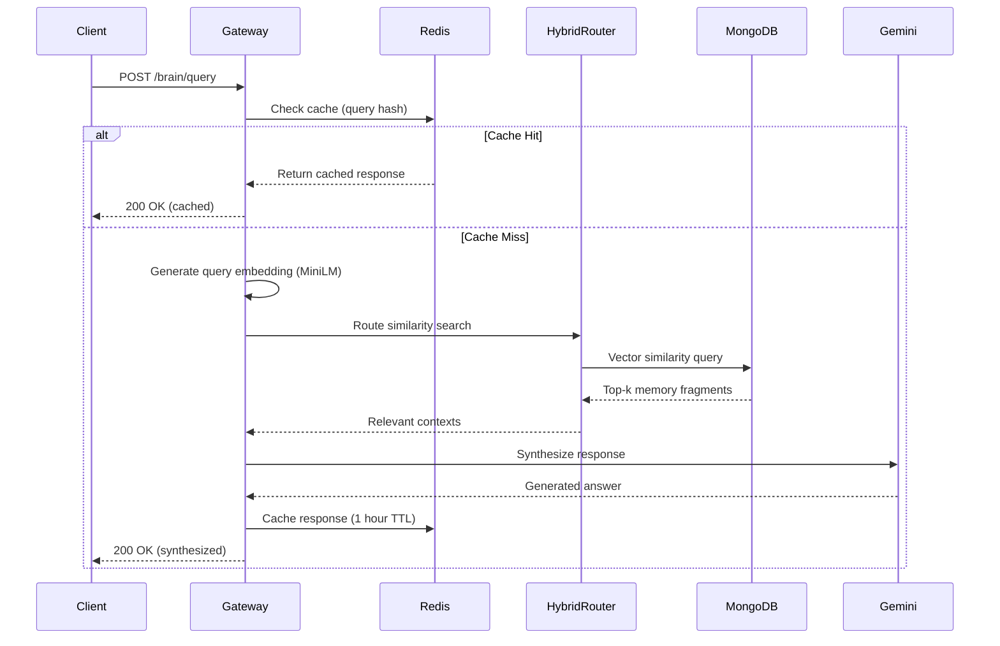
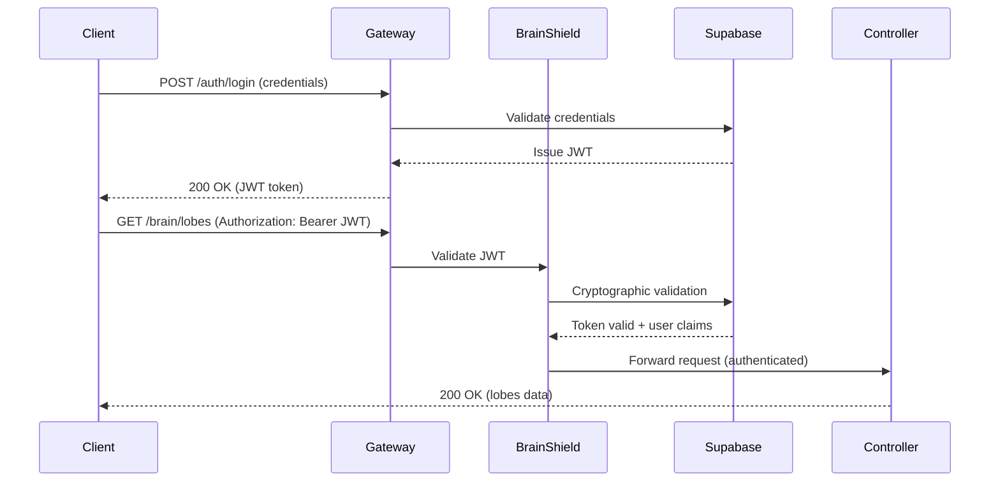

# Design Document: Brain Extension

## Overview

Brain Extension is an AI-powered Cognitive OS implementing a sophisticated event-driven microservices architecture. The system separates client-facing operations (API Gateway) from computationally intensive ML/AI processing (Dream Engine) using asynchronous message streaming via Apache Kafka. This design enables real-time user interactions while processing heavy workloads offline, ensuring scalability and responsiveness.

The architecture follows Domain-Driven Design (DDD) principles with clear bounded contexts:
- **Authentication Context**: User identity and access control
- **Cognitive Context**: Lobe management and memory organization
- **Processing Context**: Asynchronous ML/AI operations
- **Query Context**: Intelligent retrieval and synthesis
- **Visualization Context**: Neural graph generation

### Key Design Principles

1. **Separation of Concerns**: Client routing isolated from ML processing
2. **Asynchronous Processing**: Heavy operations offloaded to background workers
3. **Event-Driven Communication**: Loose coupling via Kafka message streaming
4. **Real-Time Updates**: WebSocket connections for instant client notifications
5. **Zero-Trust Security**: Every request validated cryptographically
6. **Semantic Isolation**: Vector spaces partitioned by cognitive lobes
7. **Performance Optimization**: Multi-layer caching strategy with Redis

## Architecture

### System Architecture Diagram



### Data Flow Patterns

#### Pattern 1: Memory Ingestion Flow (Asynchronous)



#### Pattern 2: Query Processing Flow (Synchronous)



#### Pattern 3: Authentication Flow



## Components and Interfaces

### 1. API Gateway (Node.js/Express)

**Responsibilities:**
- Client request routing and response handling
- JWT authentication and authorization
- WebSocket connection management
- Kafka event publishing
- Redis caching layer
- Rate limiting and request validation

**Key Modules:**

#### Brain Shield Middleware
```typescript
interface BrainShieldConfig {
  supabaseUrl: string;
  supabaseKey: string;
  publicRoutes: string[];
}

interface AuthenticatedRequest extends Request {
  user: {
    id: string;
    email: string;
    role: string;
  };
}

class BrainShield {
  async validateToken(token: string): Promise<UserClaims>;
  async authorize(req: Request, res: Response, next: NextFunction): Promise<void>;
}
```

#### Route Controllers

**Auth Controller** (`/auth/*`)
```typescript
interface LoginRequest {
  email: string;
  password: string;
}

interface LoginResponse {
  token: string;
  refreshToken: string;
  user: {
    id: string;
    email: string;
  };
}

POST /auth/login
POST /auth/register
POST /auth/refresh
POST /auth/logout
```

**Brain Controller** (`/brain/*`)
```typescript
interface QueryRequest {
  lobeId: string;
  query: string;
  topK?: number; // default: 5
}

interface QueryResponse {
  answer: string;
  sources: MemoryFragment[];
  confidence: number;
}

interface GraphRequest {
  lobeId: string;
  maxNodes?: number; // default: 100
}

interface GraphResponse {
  nodes: GraphNode[];
  edges: GraphEdge[];
}

interface LobeRequest {
  name: string;
  description?: string;
  subject: string;
}

POST /brain/query
GET /brain/graph?lobeId={id}
GET /brain/lobes
POST /brain/lobes
PUT /brain/lobes/:id
DELETE /brain/lobes/:id
POST /brain/translate
```

**Memory Controller** (`/memory/*`)
```typescript
interface CreateMemoryRequest {
  lobeId: string;
  content: string;
  type: 'text' | 'note' | 'concept';
  metadata?: Record<string, any>;
}

interface MemoryFragment {
  id: string;
  lobeId: string;
  content: string;
  type: string;
  embedding?: number[];
  assetUrl?: string;
  createdAt: Date;
  updatedAt: Date;
}

POST /memory/create
GET /memory/list?lobeId={id}
GET /memory/:id
DELETE /memory/:id
```

**Files Controller** (`/files/*`)
```typescript
interface UploadResponse {
  memoryId: string;
  assetUrl: string;
  status: 'processing' | 'queued';
}

POST /files/upload (multipart/form-data)
  - Field: file (PDF, JPG, PNG)
  - Field: lobeId
  - Field: metadata (optional JSON)
```

**Health Controller** (`/health`)
```typescript
interface HealthResponse {
  status: 'healthy' | 'degraded' | 'unhealthy';
  timestamp: Date;
  services: {
    apiGateway: ServiceHealth;
    dreamEngine: ServiceHealth;
    kafka: ServiceHealth;
    mongodb: ServiceHealth;
    redis: ServiceHealth;
    supabase: ServiceHealth;
  };
}

interface ServiceHealth {
  status: 'up' | 'down';
  latency?: number;
  message?: string;
}

GET /health
```

### 2. Dream Engine (Python/FastAPI)

**Responsibilities:**
- Consume encoding events from Kafka
- OCR and ViT-based text extraction from PDFs/images
- Generate vector embeddings using MiniLM
- Store embeddings in MongoDB
- Publish completion/failure events to Kafka

**Key Modules:**

#### FastAPI Application
```python
from fastapi import FastAPI
from pydantic import BaseModel

class EncodingEvent(BaseModel):
    memory_id: str
    lobe_id: str
    content_type: str  # 'text', 'pdf', 'image'
    content: str | None
    asset_url: str | None

class CompletionEvent(BaseModel):
    memory_id: str
    lobe_id: str
    status: str  # 'success', 'failure'
    embedding_dimensions: int
    processing_time: float
    error: str | None

app = FastAPI()

@app.get("/health")
async def health_check():
    return {"status": "healthy", "workers": get_worker_count()}
```

#### OCR/ViT Pipeline
```python
from transformers import ViTImageProcessor, ViTForImageClassification
from PIL import Image
import pytesseract

class DocumentProcessor:
    def __init__(self):
        self.vit_processor = ViTImageProcessor.from_pretrained('google/vit-base-patch16-224')
        self.vit_model = ViTForImageClassification.from_pretrained('google/vit-base-patch16-224')
    
    async def extract_text_from_pdf(self, pdf_url: str) -> str:
        """Extract text from PDF using OCR"""
        pass
    
    async def extract_text_from_image(self, image_url: str) -> str:
        """Extract text from image using ViT + OCR"""
        pass
```

#### Embedding Generator
```python
from sentence_transformers import SentenceTransformer

class EmbeddingGenerator:
    def __init__(self):
        self.model = SentenceTransformer('all-MiniLM-L6-v2')
    
    def generate_embedding(self, text: str) -> list[float]:
        """Generate 384-dimensional embedding vector"""
        return self.model.encode(text).tolist()
    
    def batch_generate(self, texts: list[str]) -> list[list[float]]:
        """Generate embeddings for multiple texts"""
        return self.model.encode(texts).tolist()
```

#### Kafka Consumer
```python
from kafka import KafkaConsumer, KafkaProducer
import json

class DreamEngineWorker:
    def __init__(self):
        self.consumer = KafkaConsumer(
            'encoding-events',
            bootstrap_servers=['kafka:9092'],
            value_deserializer=lambda m: json.loads(m.decode('utf-8'))
        )
        self.producer = KafkaProducer(
            bootstrap_servers=['kafka:9092'],
            value_serializer=lambda m: json.dumps(m).encode('utf-8')
        )
        self.processor = DocumentProcessor()
        self.embedder = EmbeddingGenerator()
    
    async def process_event(self, event: EncodingEvent):
        """Main processing loop"""
        pass
```

### 3. Hybrid Router

**Responsibilities:**
- Determine optimal vector similarity search strategy
- Execute similarity searches against MongoDB vector store
- Rank and filter results by relevance threshold

```python
from sklearn.linear_model import LogisticRegression
from sklearn.calibration import CalibratedClassifierCV

class HybridRouter:
    def __init__(self):
        self.classifier = CalibratedClassifierCV(LogisticRegression())
    
    def route_query(self, query_embedding: list[float], lobe_id: str) -> str:
        """Determine search strategy: 'cosine', 'euclidean', or 'hybrid'"""
        pass
    
    async def similarity_search(
        self, 
        query_embedding: list[float], 
        lobe_id: str, 
        top_k: int = 5,
        threshold: float = 0.7
    ) -> list[dict]:
        """Execute vector similarity search"""
        pass
```

### 4. WebSocket Manager

**Responsibilities:**
- Manage WebSocket connections per user
- Route completion events to appropriate clients
- Handle connection lifecycle (connect, disconnect, reconnect)

```typescript
import { Server as SocketIOServer } from 'socket.io';

interface SocketConnection {
  userId: string;
  socketId: string;
  connectedAt: Date;
}

class WebSocketManager {
  private io: SocketIOServer;
  private connections: Map<string, SocketConnection[]>;
  
  constructor(server: any) {
    this.io = new SocketIOServer(server, {
      cors: { origin: '*' },
      transports: ['websocket', 'polling']
    });
    this.connections = new Map();
  }
  
  async authenticate(socket: any, token: string): Promise<string>;
  async notifyUser(userId: string, event: string, data: any): Promise<void>;
  async broadcastToLobe(lobeId: string, event: string, data: any): Promise<void>;
}
```

## Data Models

### MongoDB Collections

#### Lobes Collection
```typescript
interface CognitiveLobe {
  _id: ObjectId;
  userId: string;
  name: string;
  description?: string;
  subject: string;
  createdAt: Date;
  updatedAt: Date;
  memoryCount: number;
  metadata: {
    color?: string;
    icon?: string;
    tags?: string[];
  };
}

// Indexes
db.lobes.createIndex({ userId: 1, createdAt: -1 });
db.lobes.createIndex({ userId: 1, subject: 1 });
```

#### Memories Collection
```typescript
interface MemoryFragment {
  _id: ObjectId;
  lobeId: ObjectId;
  userId: string;
  content: string;
  type: 'text' | 'pdf' | 'image' | 'note' | 'concept';
  embedding?: number[]; // 384-dimensional vector (MiniLM)
  assetUrl?: string; // Cloudinary URL
  assetType?: 'pdf' | 'jpg' | 'png';
  processingStatus: 'pending' | 'processing' | 'completed' | 'failed';
  processingError?: string;
  createdAt: Date;
  updatedAt: Date;
  metadata: {
    title?: string;
    source?: string;
    pageNumber?: number;
    extractedText?: string;
  };
}

// Indexes
db.memories.createIndex({ lobeId: 1, createdAt: -1 });
db.memories.createIndex({ userId: 1, processingStatus: 1 });
db.memories.createIndex({ lobeId: 1, embedding: "vector" }); // Vector search index
```

#### Graph Connections Collection (Computed)
```typescript
interface GraphConnection {
  _id: ObjectId;
  lobeId: ObjectId;
  sourceMemoryId: ObjectId;
  targetMemoryId: ObjectId;
  similarityScore: number; // 0.0 to 1.0
  connectionType: 'semantic' | 'temporal' | 'explicit';
  computedAt: Date;
}

// Indexes
db.connections.createIndex({ lobeId: 1, similarityScore: -1 });
db.connections.createIndex({ sourceMemoryId: 1 });
```

### Supabase (PostgreSQL) Tables

#### Users Table
```sql
CREATE TABLE users (
  id UUID PRIMARY KEY DEFAULT uuid_generate_v4(),
  email VARCHAR(255) UNIQUE NOT NULL,
  encrypted_password VARCHAR(255) NOT NULL,
  full_name VARCHAR(255),
  preferred_language VARCHAR(10) DEFAULT 'en',
  created_at TIMESTAMP DEFAULT NOW(),
  updated_at TIMESTAMP DEFAULT NOW(),
  last_login TIMESTAMP,
  is_active BOOLEAN DEFAULT TRUE
);

CREATE INDEX idx_users_email ON users(email);
CREATE INDEX idx_users_created_at ON users(created_at DESC);
```

#### User Sessions Table
```sql
CREATE TABLE user_sessions (
  id UUID PRIMARY KEY DEFAULT uuid_generate_v4(),
  user_id UUID REFERENCES users(id) ON DELETE CASCADE,
  token_hash VARCHAR(255) NOT NULL,
  refresh_token_hash VARCHAR(255),
  expires_at TIMESTAMP NOT NULL,
  created_at TIMESTAMP DEFAULT NOW(),
  ip_address INET,
  user_agent TEXT
);

CREATE INDEX idx_sessions_user_id ON user_sessions(user_id);
CREATE INDEX idx_sessions_expires_at ON user_sessions(expires_at);
```

#### Usage Analytics Table
```sql
CREATE TABLE usage_analytics (
  id UUID PRIMARY KEY DEFAULT uuid_generate_v4(),
  user_id UUID REFERENCES users(id) ON DELETE CASCADE,
  event_type VARCHAR(50) NOT NULL,
  lobe_id VARCHAR(255),
  memory_id VARCHAR(255),
  query_text TEXT,
  response_time_ms INTEGER,
  created_at TIMESTAMP DEFAULT NOW(),
  metadata JSONB
);

CREATE INDEX idx_analytics_user_id ON usage_analytics(user_id, created_at DESC);
CREATE INDEX idx_analytics_event_type ON usage_analytics(event_type);
```

### Redis Cache Structures

#### Query Cache
```
Key Pattern: query:{lobeId}:{queryHash}
Value: JSON string of QueryResponse
TTL: 3600 seconds (1 hour)

Example:
query:507f1f77bcf86cd799439011:a3f5e8b2c1d4 -> {
  "answer": "...",
  "sources": [...],
  "confidence": 0.85,
  "cachedAt": "2024-01-15T10:30:00Z"
}
```

#### User Session Cache
```
Key Pattern: session:{userId}
Value: JSON string of user session data
TTL: 86400 seconds (24 hours)

Example:
session:user_123 -> {
  "userId": "user_123",
  "email": "student@example.com",
  "lobes": ["lobe_1", "lobe_2"],
  "lastActivity": "2024-01-15T10:30:00Z"
}
```

#### Rate Limiting
```
Key Pattern: ratelimit:{userId}:{endpoint}
Value: Request count
TTL: 60 seconds (1 minute)

Example:
ratelimit:user_123:/brain/query -> 15
```

### Kafka Topics and Message Schemas

#### Topic: encoding-events
```json
{
  "topic": "encoding-events",
  "partitions": 6,
  "replication_factor": 2,
  "message_schema": {
    "memory_id": "string (ObjectId)",
    "lobe_id": "string (ObjectId)",
    "user_id": "string (UUID)",
    "content_type": "enum: text|pdf|image",
    "content": "string|null",
    "asset_url": "string|null",
    "timestamp": "ISO8601 datetime",
    "priority": "enum: high|normal|low"
  }
}
```

#### Topic: completion-events
```json
{
  "topic": "completion-events",
  "partitions": 6,
  "replication_factor": 2,
  "message_schema": {
    "memory_id": "string (ObjectId)",
    "lobe_id": "string (ObjectId)",
    "user_id": "string (UUID)",
    "status": "enum: success|failure",
    "embedding_dimensions": "integer",
    "processing_time_ms": "integer",
    "error": "string|null",
    "timestamp": "ISO8601 datetime"
  }
}
```

#### Topic: failure-events
```json
{
  "topic": "failure-events",
  "partitions": 3,
  "replication_factor": 2,
  "message_schema": {
    "memory_id": "string (ObjectId)",
    "lobe_id": "string (ObjectId)",
    "user_id": "string (UUID)",
    "error_type": "enum: ocr_failed|embedding_failed|storage_failed|timeout",
    "error_message": "string",
    "stack_trace": "string|null",
    "retry_count": "integer",
    "timestamp": "ISO8601 datetime"
  }
}
```


## Correctness Properties

A property is a characteristic or behavior that should hold true across all valid executions of a system—essentially, a formal statement about what the system should do. Properties serve as the bridge between human-readable specifications and machine-verifiable correctness guarantees.

### Authentication and Authorization Properties

**Property 1: Valid credentials produce valid JWTs**
*For any* valid user credentials, when submitted to /auth/login, the API Gateway should issue a Supabase JWT containing the correct user identity claims (user ID, email, role).
**Validates: Requirements 1.1**

**Property 2: Invalid credentials are rejected**
*For any* invalid credential combination (wrong password, non-existent email, malformed input), the API Gateway should reject the authentication request and return an appropriate error.
**Validates: Requirements 1.2**

**Property 3: Valid JWTs grant access**
*For any* valid Supabase JWT, when included in the Authorization header, the Brain Shield middleware should cryptographically validate the token and allow the request to proceed.
**Validates: Requirements 1.3**

**Property 4: Invalid JWTs are rejected**
*For any* invalid or expired JWT (tampered signature, expired timestamp, malformed structure), the Brain Shield middleware should reject the request and return an authorization error.
**Validates: Requirements 1.4**

**Property 5: Token refresh preserves identity**
*For any* valid JWT, when refreshed via /auth/refresh, the new JWT should contain the same user identity claims as the original token (round-trip property).
**Validates: Requirements 1.6**

### Cognitive Lobe Management Properties

**Property 6: Lobe creation produces unique identifiers**
*For any* lobe creation request, the API Gateway should create a new Cognitive Lobe in MongoDB with a unique identifier that differs from all existing lobe IDs.
**Validates: Requirements 2.1**

**Property 7: Lobe listing returns exact ownership**
*For any* authenticated user, listing lobes via /brain/lobes should return exactly the set of Cognitive Lobes where userId matches the authenticated user's ID, with no lobes from other users.
**Validates: Requirements 2.2**

**Property 8: Lobe deletion cascades to memories**
*For any* Cognitive Lobe with associated Memory Fragments, deleting the lobe should remove both the lobe and all its associated memories from MongoDB, leaving no orphaned data.
**Validates: Requirements 2.3**

**Property 9: Lobe updates are persisted**
*For any* lobe metadata update, the changes should be reflected in MongoDB such that subsequent reads return the updated values.
**Validates: Requirements 2.4**

**Property 10: Vector searches are lobe-isolated**
*For any* query executed within a specific Cognitive Lobe, the similarity search should only return Memory Fragments belonging to that lobe, never returning fragments from other lobes regardless of similarity score.
**Validates: Requirements 2.5**

### Memory Ingestion Properties

**Property 11: Text memory creation triggers storage and event**
*For any* text memory creation request, the API Gateway should both store the Memory Fragment in MongoDB and publish an encoding event to Kafka (both side effects must occur).
**Validates: Requirements 3.1**

**Property 12: File upload completes full pipeline**
*For any* valid file upload (PDF, JPG, or PNG under 50MB), the API Gateway should complete all pipeline steps: Multer parsing, Cloudinary upload, MongoDB storage, and Kafka event publishing.
**Validates: Requirements 3.2, 3.3**

**Property 13: Invalid file formats are rejected**
*For any* file upload with an unsupported format (not PDF, JPG, PNG, or text), the API Gateway should reject the upload and return a format error without storing any data.
**Validates: Requirements 3.5**

**Property 14: Memory listing returns lobe contents**
*For any* Cognitive Lobe, listing memories via /memory/list should return exactly the set of Memory Fragments where lobeId matches the specified lobe.
**Validates: Requirements 3.6**

**Property 15: Memory deletion includes asset cleanup**
*For any* Memory Fragment with an associated Cloudinary asset, deleting the memory should remove both the MongoDB document and the Cloudinary asset.
**Validates: Requirements 3.7**

### Asynchronous Processing Properties

**Property 16: Encoding events are consumed**
*For any* encoding event published to Kafka, the Dream Engine should consume and process the event asynchronously.
**Validates: Requirements 4.1**

**Property 17: PDF/Image text extraction occurs**
*For any* PDF or image Memory Fragment, the Dream Engine should extract text content using OCR and Vision Transformer models, producing non-empty extracted text for documents containing text.
**Validates: Requirements 4.2, 4.3**

**Property 18: Text content is preserved**
*For any* text Memory Fragment, the Dream Engine should use the original text content directly without modification (input equals extracted content).
**Validates: Requirements 4.4**

**Property 19: Embeddings have correct dimensions**
*For any* extracted content, the Dream Engine should generate vector embeddings using MiniLM that are exactly 384-dimensional arrays of floating-point numbers.
**Validates: Requirements 4.5**

**Property 20: Embeddings are persisted with memories**
*For any* generated embedding, the Dream Engine should store it in MongoDB associated with the correct Memory Fragment ID before publishing completion.
**Validates: Requirements 4.6**

**Property 21: Processing completion triggers events**
*For any* successfully processed Memory Fragment, the Dream Engine should publish a completion event to Kafka with status "success".
**Validates: Requirements 4.7**

**Property 22: Completion events trigger WebSocket notifications**
*For any* completion event received from Kafka, the API Gateway should push a real-time notification through the WebSocket connection to the user who owns the processed memory.
**Validates: Requirements 4.8**

**Property 23: Processing errors trigger failure events**
*For any* Memory Fragment that fails processing, the Dream Engine should publish a failure event to Kafka with error details and status "failure".
**Validates: Requirements 4.9**

### Query Processing Properties

**Property 24: Queries generate embeddings**
*For any* query submitted via /brain/query, the API Gateway should generate a 384-dimensional vector embedding using the same MiniLM model used for memory encoding.
**Validates: Requirements 5.1**

**Property 25: Hybrid Router selects strategies**
*For any* query embedding, the Hybrid Router should determine and return a valid similarity search strategy (cosine, euclidean, or hybrid).
**Validates: Requirements 5.2**

**Property 26: Similarity search returns top-k results**
*For any* similarity search within a Cognitive Lobe, the results should be ranked by similarity score in descending order and limited to the top-k most similar Memory Fragments.
**Validates: Requirements 5.3**

**Property 27: Retrieved contexts produce synthesized responses**
*For any* set of retrieved Memory Fragments above the relevance threshold, the API Gateway should use Gemini LLM to synthesize a contextual response that references the retrieved content.
**Validates: Requirements 5.4, 5.5**

### Translation Properties

**Property 28: Translation requests are accepted**
*For any* translation request with valid source text and a supported language code, the API Gateway should accept and process the request.
**Validates: Requirements 6.1**

**Property 29: Translations use LangChain pipeline**
*For any* translation request, the API Gateway should execute the LangChain + Gemini LLM pipeline to produce the translated output.
**Validates: Requirements 6.2**

**Property 30: Code syntax is preserved in translation**
*For any* source text containing programming syntax (curly braces, keywords, function names, operators), the translated output should preserve all code elements character-for-character unchanged while translating surrounding natural language.
**Validates: Requirements 6.3, 6.4**

**Property 31: All target languages are supported**
*For any* translation request specifying Hindi, Tamil, Telugu, Kannada, Bengali, Marathi, or Gujarati as the target language, the API Gateway should successfully produce a translation.
**Validates: Requirements 6.5**

### Neural Graph Properties

**Property 32: Graph computation includes all lobe memories**
*For any* Cognitive Lobe, requesting graph data via /brain/graph should compute connections between all Memory Fragments in that lobe.
**Validates: Requirements 7.1**

**Property 33: Edge weights reflect similarity scores**
*For any* pair of connected nodes in the neural graph, the edge weight should correspond to the vector similarity score between the two Memory Fragments.
**Validates: Requirements 7.2**

**Property 34: Graph data is properly formatted**
*For any* graph response, the data should be formatted with separate node and edge arrays compatible with React Native Reanimated rendering.
**Validates: Requirements 7.3**

**Property 35: Graph responses include complete metadata**
*For any* graph response, all nodes should include metadata (title, type, creation date) and all edges should include metadata (similarity score, connection strength).
**Validates: Requirements 7.5, 7.6**

### Real-Time Communication Properties

**Property 36: Authenticated users establish WebSocket connections**
*For any* authenticated Client Application connection attempt, the API Gateway should establish a WebSocket connection associated with the user's ID.
**Validates: Requirements 8.1**

**Property 37: Completion events reach correct users**
*For any* Dream Engine completion event, the API Gateway should push a notification through the WebSocket connection to the user who owns the processed memory, and not to other users.
**Validates: Requirements 8.2**

**Property 38: Failure events reach correct users**
*For any* Dream Engine failure event, the API Gateway should push an error notification through the WebSocket connection to the user who owns the failed memory.
**Validates: Requirements 8.3**

**Property 39: Disconnections trigger cleanup**
*For any* user disconnection, the API Gateway should remove the WebSocket connection from the active connections map and release associated resources.
**Validates: Requirements 8.5**

### Caching Properties

**Property 40: Cache is checked before processing**
*For any* query request, the API Gateway should check Redis cache using a hash of the query text and lobe ID before executing the full query pipeline.
**Validates: Requirements 9.1**

**Property 41: Fresh cached responses are returned immediately**
*For any* query with a cached response less than 1 hour old, the API Gateway should return the cached response without executing similarity search or LLM synthesis.
**Validates: Requirements 9.2**

**Property 42: Cache misses populate cache**
*For any* query without a valid cache entry, after processing the query normally, the API Gateway should store the result in Redis cache with a 1-hour TTL.
**Validates: Requirements 9.3**

**Property 43: Lobe modifications invalidate cache**
*For any* Memory Fragment addition or deletion in a Cognitive Lobe, the API Gateway should invalidate all cached query responses for that lobe.
**Validates: Requirements 9.4**

**Property 44: System degrades gracefully without cache**
*For any* query when Redis is unavailable, the API Gateway should process the query normally and return results without caching, maintaining core functionality.
**Validates: Requirements 9.5**

### Health Monitoring Properties

**Property 45: Health endpoint returns comprehensive status**
*For any* health check request to /health, the API Gateway should return a response including its own status and the status of all critical services (Dream Engine, Kafka, MongoDB, Redis, Supabase).
**Validates: Requirements 10.1, 10.2, 10.3, 10.4, 10.5, 10.6**

**Property 46: Service failures produce degraded status**
*For any* health check when at least one critical service is unavailable, the API Gateway should return a health status of "degraded" or "unhealthy" rather than "healthy".
**Validates: Requirements 10.7**

### Error Handling and Resilience Properties

**Property 47: Events queue when worker unavailable**
*For any* encoding event published when the Dream Engine is unavailable, the event should remain in the Kafka queue for later processing when the worker recovers.
**Validates: Requirements 11.1**

**Property 48: Database failures return appropriate errors**
*For any* request when MongoDB is unavailable, the API Gateway should return a service unavailable error (503) with retry guidance.
**Validates: Requirements 11.2**

**Property 49: Rate limits return appropriate errors**
*For any* request when Gemini LLM rate limits are exceeded, the API Gateway should return a rate limit error (429) with suggested retry timing.
**Validates: Requirements 11.3**

**Property 50: Failed uploads retry with backoff**
*For any* Cloudinary upload failure, the API Gateway should retry the upload up to 3 times with exponential backoff before returning an error.
**Validates: Requirements 11.4**

**Property 51: Unhandled exceptions are logged and sanitized**
*For any* unhandled exception, the API Gateway should log the full error context (stack trace, request details) while returning a generic error message to the client without exposing internal details.
**Validates: Requirements 11.5**

**Property 52: Kafka failures return appropriate errors**
*For any* request requiring Kafka when the broker is unavailable, the API Gateway should log the error and return a queueing failure message.
**Validates: Requirements 11.6**

### Data Consistency Properties

**Property 53: Memory writes are atomic**
*For any* Memory Fragment creation, either all data (document, references, metadata) is written to MongoDB or none of it is, with no partial writes.
**Validates: Requirements 12.1**

**Property 54: Lobe deletion is transactional**
*For any* Cognitive Lobe deletion, either both the lobe and all associated Memory Fragments are deleted or none are deleted (atomic cascade).
**Validates: Requirements 12.2**

**Property 55: Completion events follow successful writes**
*For any* embedding storage operation, the Dream Engine should only publish a completion event after verifying the successful write to MongoDB.
**Validates: Requirements 12.3**

**Property 56: Asset references are validated**
*For any* Cloudinary asset reference being stored, the API Gateway should verify the asset exists at the URL before storing the reference in MongoDB.
**Validates: Requirements 12.4**

**Property 57: Write failures trigger rollbacks**
*For any* database write failure during a multi-step operation, the API Gateway should rollback any partial changes and return an error, leaving the database in a consistent state.
**Validates: Requirements 12.5**

### Scalability Properties

**Property 58: Dream Engine processes events in parallel**
*For any* set of multiple encoding events in the Kafka queue, the Dream Engine should process them concurrently up to the configured worker limit rather than sequentially.
**Validates: Requirements 13.2**

**Property 59: Capacity warnings are logged**
*For any* MongoDB storage exceeding 80% capacity or Kafka queue depth exceeding 10,000 messages, the system should log a warning for administrative action.
**Validates: Requirements 13.3, 13.4**

## Error Handling

### Error Classification

The system implements a hierarchical error handling strategy with the following error categories:

#### 1. Client Errors (4xx)
- **400 Bad Request**: Malformed request body, invalid parameters, validation failures
- **401 Unauthorized**: Missing or invalid JWT token
- **403 Forbidden**: Valid token but insufficient permissions
- **404 Not Found**: Resource (lobe, memory) does not exist
- **413 Payload Too Large**: File upload exceeds 50MB limit
- **415 Unsupported Media Type**: Invalid file format
- **429 Too Many Requests**: Rate limit exceeded

#### 2. Server Errors (5xx)
- **500 Internal Server Error**: Unhandled exceptions, unexpected failures
- **502 Bad Gateway**: External service (Gemini, Cloudinary) failure
- **503 Service Unavailable**: Database or Kafka unavailable
- **504 Gateway Timeout**: Query processing exceeds 30 seconds

### Error Response Format

All errors follow a consistent JSON structure:

```typescript
interface ErrorResponse {
  error: {
    code: string;           // Machine-readable error code
    message: string;        // Human-readable error message
    details?: any;          // Additional context (validation errors, etc.)
    timestamp: string;      // ISO8601 timestamp
    requestId: string;      // Unique request identifier for tracing
    retryAfter?: number;    // Seconds to wait before retry (for 429, 503)
  };
}
```

### Error Handling Strategies

#### Retry Logic
```typescript
interface RetryConfig {
  maxAttempts: 3;
  baseDelay: 1000;        // milliseconds
  maxDelay: 10000;        // milliseconds
  backoffMultiplier: 2;   // exponential backoff
}

// Applied to:
// - Cloudinary uploads
// - External API calls (Gemini)
// - Transient database errors
```

#### Circuit Breaker Pattern
```typescript
interface CircuitBreakerConfig {
  failureThreshold: 5;     // Failures before opening circuit
  resetTimeout: 60000;     // milliseconds before attempting reset
  monitoringWindow: 120000; // milliseconds for failure counting
}

// Applied to:
// - Gemini LLM calls
// - Cloudinary API calls
// - Dream Engine health checks
```

#### Graceful Degradation

When non-critical services fail, the system continues operating with reduced functionality:

- **Redis unavailable**: Queries processed without caching (slower but functional)
- **Dream Engine unavailable**: Uploads accepted and queued for later processing
- **Gemini unavailable**: Return cached responses or error with retry guidance
- **Cloudinary unavailable**: Accept text-only memories, queue file uploads

### Error Logging

All errors are logged with structured context:

```typescript
interface ErrorLog {
  level: 'error' | 'warn' | 'fatal';
  timestamp: Date;
  requestId: string;
  userId?: string;
  endpoint: string;
  method: string;
  errorCode: string;
  errorMessage: string;
  stackTrace?: string;
  context: {
    lobeId?: string;
    memoryId?: string;
    queryText?: string;
    [key: string]: any;
  };
}
```

## Testing Strategy

The Brain Extension system requires a comprehensive dual testing approach combining unit tests for specific scenarios and property-based tests for universal correctness guarantees.

### Testing Philosophy

- **Unit tests**: Verify specific examples, edge cases, and integration points
- **Property tests**: Verify universal properties across all inputs through randomization
- **Complementary coverage**: Both approaches are necessary for comprehensive validation

### Property-Based Testing Configuration

**Framework Selection:**
- **Node.js/TypeScript**: fast-check library
- **Python**: Hypothesis library

**Test Configuration:**
- Minimum 100 iterations per property test (due to randomization)
- Each property test must reference its design document property
- Tag format: `Feature: brain-extension, Property {number}: {property_text}`

### Testing Layers

#### 1. Unit Testing Focus Areas

**Authentication & Authorization**
- Specific JWT validation scenarios (expired, tampered, missing claims)
- Edge cases: malformed tokens, empty headers, special characters in credentials
- Integration: Supabase JWT issuance and validation flow

**API Endpoints**
- Request validation: missing fields, invalid types, boundary values
- Response format verification for each endpoint
- Error response structure consistency
- Integration: Controller → Service → Database flows

**File Upload**
- Edge cases: 50MB boundary, empty files, corrupted files
- Multipart parsing with various content types
- Cloudinary integration: upload success/failure scenarios

**WebSocket Communication**
- Connection lifecycle: connect, disconnect, reconnect
- Message routing to correct users
- Connection cleanup on disconnect

**Caching**
- Cache hit/miss scenarios
- TTL expiration edge cases
- Cache invalidation triggers
- Redis unavailability handling

**Error Handling**
- Specific error scenarios for each error type
- Retry logic with mocked failures
- Circuit breaker state transitions
- Graceful degradation scenarios

#### 2. Property-Based Testing Focus Areas

**Authentication Properties (Properties 1-5)**
```typescript
// Example: Property 3 - Valid JWTs grant access
import fc from 'fast-check';

// Feature: brain-extension, Property 3: Valid JWTs grant access
test('valid JWTs grant access', async () => {
  await fc.assert(
    fc.asyncProperty(
      fc.record({
        userId: fc.uuid(),
        email: fc.emailAddress(),
        role: fc.constantFrom('student', 'admin')
      }),
      async (userClaims) => {
        const jwt = await issueJWT(userClaims);
        const result = await brainShield.validateToken(jwt);
        expect(result.valid).toBe(true);
        expect(result.claims.userId).toBe(userClaims.userId);
      }
    ),
    { numRuns: 100 }
  );
});
```

**Lobe Management Properties (Properties 6-10)**
```python
# Example: Property 10 - Vector searches are lobe-isolated
from hypothesis import given, strategies as st

# Feature: brain-extension, Property 10: Vector searches are lobe-isolated
@given(
    lobe1_memories=st.lists(st.text(min_size=10), min_size=5, max_size=20),
    lobe2_memories=st.lists(st.text(min_size=10), min_size=5, max_size=20),
    query=st.text(min_size=5)
)
def test_vector_search_isolation(lobe1_memories, lobe2_memories, query):
    lobe1 = create_lobe_with_memories(lobe1_memories)
    lobe2 = create_lobe_with_memories(lobe2_memories)
    
    results = search_lobe(lobe1.id, query)
    
    # All results must belong to lobe1
    assert all(r.lobe_id == lobe1.id for r in results)
    # No results from lobe2
    assert not any(r.lobe_id == lobe2.id for r in results)
```

**Memory Ingestion Properties (Properties 11-15)**
- Generate random text content, verify storage and event publishing
- Generate random valid files, verify complete pipeline execution
- Generate random invalid formats, verify rejection

**Asynchronous Processing Properties (Properties 16-23)**
- Generate random encoding events, verify consumption
- Generate random text content, verify embedding dimensions (384)
- Generate random processing scenarios, verify completion/failure events

**Query Processing Properties (Properties 24-27)**
- Generate random queries, verify embedding generation
- Generate random query embeddings, verify strategy selection
- Generate random similarity searches, verify top-k ranking

**Translation Properties (Properties 28-31)**
- Generate random text with embedded code, verify syntax preservation
- Generate random language combinations, verify support
- Critical: Round-trip property for code syntax preservation

**Graph Properties (Properties 32-35)**
- Generate random lobe structures, verify graph computation
- Generate random node pairs, verify edge weight calculation
- Generate random graphs, verify metadata completeness

**Caching Properties (Properties 40-44)**
- Generate random queries, verify cache hit/miss behavior
- Generate random lobe modifications, verify cache invalidation
- Verify graceful degradation without Redis

**Data Consistency Properties (Properties 53-57)**
- Generate random write operations, verify atomicity
- Generate random deletion operations, verify transactional behavior
- Generate random failure scenarios, verify rollback behavior

### Integration Testing

**End-to-End Flows**
1. **Memory Ingestion Flow**: Upload → Kafka → Dream Engine → Embedding → WebSocket notification
2. **Query Flow**: Query → Cache check → Embedding → Search → LLM → Response
3. **Authentication Flow**: Login → JWT issuance → Protected endpoint access

**Service Integration**
- API Gateway ↔ Supabase authentication
- API Gateway ↔ MongoDB operations
- API Gateway ↔ Kafka event publishing
- Dream Engine ↔ Kafka event consumption
- Dream Engine ↔ MongoDB embedding storage
- API Gateway ↔ Gemini LLM synthesis
- API Gateway ↔ Cloudinary uploads

### Performance Testing

**Load Testing Scenarios**
- Concurrent query processing (100+ simultaneous requests)
- Bulk memory ingestion (1000+ memories)
- WebSocket connection scaling (1000+ concurrent connections)
- Cache performance under load

**Benchmarks**
- Query response time: < 2 seconds (cached), < 5 seconds (uncached)
- File upload processing: < 30 seconds for 50MB files
- Embedding generation: < 1 second per memory
- WebSocket notification latency: < 100ms

### Test Data Generation

**Generators for Property Tests**
```typescript
// Custom generators for domain objects
const lobeGenerator = fc.record({
  name: fc.string({ minLength: 1, maxLength: 100 }),
  subject: fc.constantFrom('Math', 'Physics', 'CS', 'Chemistry'),
  description: fc.option(fc.string({ maxLength: 500 }))
});

const memoryGenerator = fc.record({
  content: fc.string({ minLength: 10, maxLength: 5000 }),
  type: fc.constantFrom('text', 'note', 'concept'),
  metadata: fc.dictionary(fc.string(), fc.anything())
});

const queryGenerator = fc.string({ minLength: 5, maxLength: 500 });

const embeddingGenerator = fc.array(fc.float({ min: -1, max: 1 }), { 
  minLength: 384, 
  maxLength: 384 
});
```

### Continuous Testing

**Pre-commit Hooks**
- Run unit tests for changed files
- Run linting and type checking
- Run fast property tests (10 iterations)

**CI/CD Pipeline**
- Full unit test suite
- Full property test suite (100 iterations)
- Integration tests
- Performance regression tests
- Security scanning

**Monitoring in Production**
- Error rate tracking by endpoint
- Response time percentiles (p50, p95, p99)
- Cache hit rate monitoring
- Kafka lag monitoring
- Dream Engine processing time tracking
